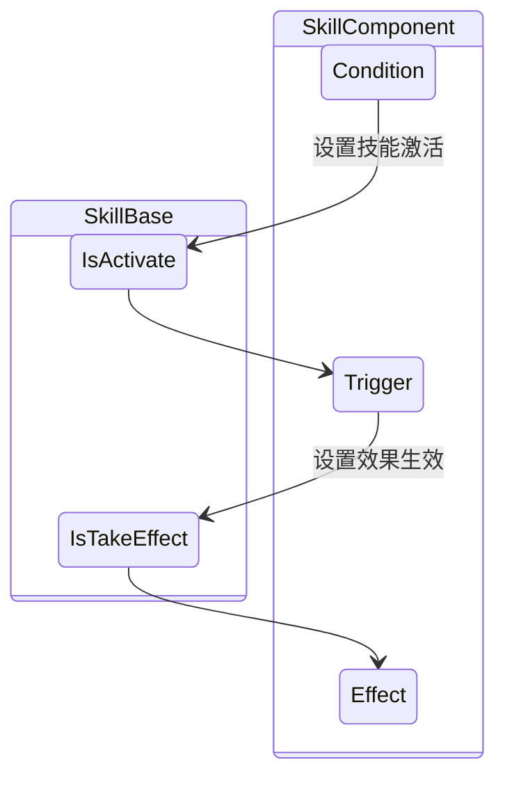
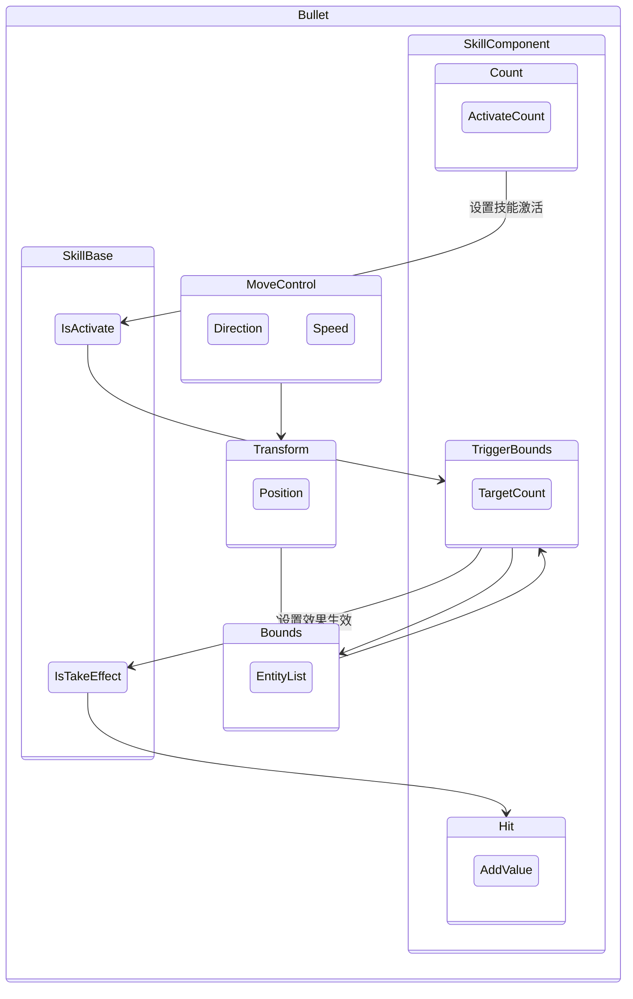

基础技能触发流程

```mermaid
stateDiagram-v2
    state SkillBase{
        IsActivate
        IsTakeEffect
    }
    state SkillComponent{
        Condition
        Trigger
        Effect
    }
    Condition --> IsActivate : 设置技能激活
    IsActivate --> Trigger
    Trigger --> IsTakeEffect : 设置效果生效
    IsTakeEffect --> Effect
```
子弹

```mermaid
stateDiagram-v2
    state SkillBase{
        IsActivate
        IsTakeEffect
    }
    state Count{
        ActivateCount
    }
    state TriggerBounds{
        TargetCount
    }
    state Hit{
        AddValue
    }
    state SkillComponent{
        Count
        TriggerBounds
        Hit
    }
    state Transform{
        Position
    }
    state Bounds{
        EntityList
    }
    state MoveControl{
        Direction
        Speed
    }
    state Bullet{
        SkillBase
        SkillComponent
        MoveControl
        Transform
        Bounds
    }

    MoveControl --> Transform
    Transform --> Bounds

    Count --> IsActivate : 设置技能激活
    IsActivate --> TriggerBounds
    TriggerBounds --> Bounds
    Bounds --> TriggerBounds
    TriggerBounds --> IsTakeEffect : 设置效果生效
    IsTakeEffect --> Hit
```
